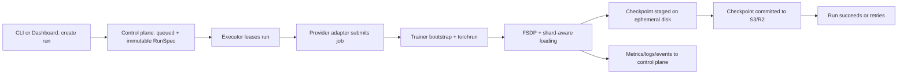

# Training Stack (Lambda + Runpod)

## Goal
Build a provider-agnostic distributed training stack where:
- Trainer runtime owns FSDP, data sharding, and checkpoint/resume.
- Provider adapters own job submission and lifecycle integration.
- Object storage is the durable source of truth.
- Ephemeral node disk is a performance cache only.

## Architecture Summary
1. Control plane stores immutable run specs, run state, queue, metadata, and artifact index.
2. Executor leases queued runs and dispatches through provider adapters.
3. Adapter submits provider-native job (Lambda/K8s or Runpod/Slurm).
4. Trainer runtime performs distributed training with FSDP and shard-aware loading.
5. Checkpoints/logs/artifacts are persisted to S3/R2.

## Components
- Control plane: [CONTROL_PLANE.md](./CONTROL_PLANE.md)
- Provider adapters: [PROVIDER_ADAPTERS.md](./PROVIDER_ADAPTERS.md)
- Trainer runtime: [TRAINER_RUNTIME.md](./TRAINER_RUNTIME.md)
- Object storage: [OBJECT_STORAGE.md](./OBJECT_STORAGE.md)
- Ephemeral node disk: [EPHEMERAL_NODE_DISK.md](./EPHEMERAL_NODE_DISK.md)

## Golden Flow

## Right-Sized MVP
- One canonical `RunSpec`.
- Two adapters:
  - `lambda-k8s`
  - `runpod-slurm`
- One trainer runtime package for all providers.
- One object-storage layout for datasets/checkpoints/artifacts.
- One ephemeral cache policy and checkpoint staging path.

## Explicit Non-Goals for MVP
- No provider-specific training code forks.
- No persistent volume dependency for training correctness.
- No custom distributed filesystem.
- No elastic world-size changes during a run.
