# Training Stack (Current + Next)

Last updated: 2026-03-09

## What Changed Recently
- Run lifecycle moved from mocked timing to real provisioning + runtime callbacks.
- CLI sync moved to incremental blob upload with pinned manifests.
- Run creation now provisions immediately and surfaces real capacity failures.

## Current Implementation (Today)
1. CLI `train` / `run create` performs pre-run sync.
2. CLI builds code/data manifests (`sha256`, `path`, `size`, `mode`), uploads only missing blobs, uploads manifests, then calls `/api/sync/commit`.
3. Control plane creates run and provisions a Runpod pod.
4. Pod bootstrap fetches `/api/runs/{run_id}/runtime/bootstrap`, materializes pinned code/data into `/workspace`, verifies hashes, then starts `train.py`.
5. Pod sends logs/metrics/status to runtime endpoints.
6. Control plane persists runtime logs/metrics and updates terminal run status.

## Current Flow

```mermaid
flowchart LR
A["CLI: tahuna train"] --> B["Incremental sync: blobs + manifests + commit"]
B --> C["POST /api/environments/{env_id}/runs"]
C --> D["Convex: createAndProvisionRunStrict"]
D --> E["Runpod pod created"]
E --> F["Pod GET /runtime/bootstrap"]
F --> G["Materialize /workspace + verify hashes"]
G --> H["Run python3 -u train.py"]
H --> I["POST runtime/logs, runtime/metrics, runtime/status"]
I --> J["Run status in Convex"]
```

## Component Docs
- Control plane: [CONTROL_PLANE.md](./CONTROL_PLANE.md)
- Provider adapters: [PROVIDER_ADAPTERS.md](./PROVIDER_ADAPTERS.md)
- Trainer runtime: [TRAINER_RUNTIME.md](./TRAINER_RUNTIME.md)
- Object storage: [OBJECT_STORAGE.md](./OBJECT_STORAGE.md)
- Ephemeral node disk: [EPHEMERAL_NODE_DISK.md](./EPHEMERAL_NODE_DISK.md)

## Current Limitations
- No FSDP / `torchrun` orchestration yet.
- No Lambda adapter yet.
- No checkpoint commit/resume pipeline yet.
- Runtime is currently single-process `train.py` bootstrap in pod.

## Next Phase
- Add provider abstraction layer (`runpod` + `lambda`).
- Replace bootstrap single-process runner with trainer runtime supporting FSDP and sharded data loading.
- Add checkpoint metadata + durable resume contract.
