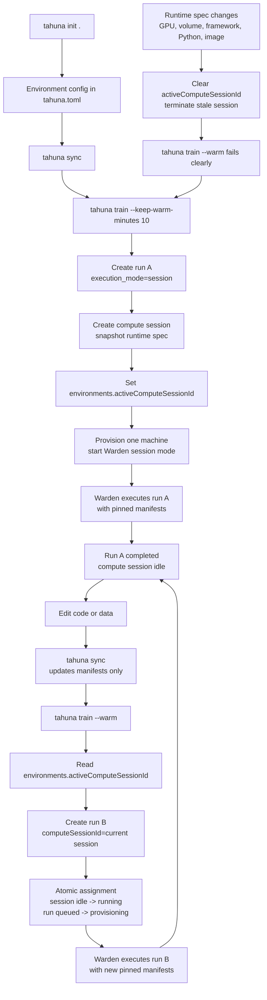

# Separate Compute Lifetime From Run Lifetime

## Current Model

Tahuna now treats a training run and its machine lifetime as separate concepts.

A **run** is one recorded training execution. It owns the pinned code/data manifests, logs, metrics, artifacts, status, and terminal result.

A **compute session** is a long-lived machine lease owned by one environment. It can execute multiple sequential runs while it stays warm.

The user-facing surface remains run-first:

```bash
tahuna init .
tahuna sync
tahuna train --keep-warm-minutes 10

# edit code
tahuna sync
tahuna train --warm
```

There is no user-facing `tahuna compute create` flow for the main warm-compute path. Warm compute is an extension of `tahuna train`.

## Flow Diagram



## User Story

### Start Warm Compute

```bash
tahuna train --keep-warm-minutes 10
```

Tahuna creates a normal run, provisions one machine in session mode, executes the run, then keeps the machine idle for the requested duration.

After completion the CLI prints the remaining warm time:

```text
Run completed.
Compute is warm for another 10 minutes.

Next run:
  tahuna sync
  tahuna train --warm
```

### Reuse Warm Compute

```bash
tahuna sync
tahuna train --warm
```

Tahuna creates a new run and assigns it to the environment's current warm compute session. It does not provision a new machine and it does not silently fall back to ephemeral compute.

Each reused run has its own run ID, pinned manifests, logs, metrics, artifacts, and terminal status.

### Environment Default

During `tahuna init .`, the CLI can store:

```toml
[train]
keep_warm_after_minutes = 10
```

Then:

```bash
tahuna train
```

behaves like:

```bash
tahuna train --keep-warm-minutes 10
```

Users can override this per run:

```bash
tahuna train --no-keep-warm
tahuna train --keep-warm-minutes 30
```

Keep-warm duration is always expressed in minutes. Fractional values are valid, for example `0.5`.

## Canonical Ownership

Warm compute is environment-scoped.

Each environment has at most one current warm compute session:

```ts
environments.activeComputeSessionId?: Id<"computeSessions">
```

That field is the canonical link for `tahuna train --warm`. The backend does not search for "some compatible idle session" and does not guess.

When a new keep-warm run creates a compute session:

1. Tahuna creates a `computeSessions` row.
2. Tahuna sets `environments.activeComputeSessionId` to that session.
3. If the environment already had an active session, the old one is scheduled for termination.

When a warm run is requested:

1. Backend reads `environments.activeComputeSessionId`.
2. Backend loads that exact compute session.
3. Backend requires it to be `idle`.
4. Backend creates a queued session-mode run with `computeSessionId`.
5. Backend atomically assigns that run to the session.

If there is no current active session, the API fails clearly:

```text
warm compute is stale for this environment; run `tahuna train --keep-warm-minutes 10`
```

If the current session is busy, the API fails clearly instead of starting another machine.

## Runtime Spec Changes

The environment defines the intended runtime spec:

- GPU type
- GPU count
- volume size
- framework
- framework version
- Python version
- resolved image name

The compute session stores a snapshot of those values from when the machine was created.

Changing code or data does **not** invalidate warm compute. That is the point of the loop: sync new code/data, create a new run, materialize that run's pinned manifests on the existing machine.

Changing the runtime spec **does** invalidate warm compute. Runtime spec changes can come from:

- `tahuna sync` pushing changed `[environment]` fields from local `tahuna.toml`
- environment update endpoints
- dashboard environment config edits

When runtime spec changes:

1. `environments.activeComputeSessionId` is cleared.
2. The old active compute session is scheduled for termination.
3. Future `tahuna train --warm` fails with the stale warm-compute error until the user starts a new keep-warm run.

## Data Model

### `environments`

| Field | Description |
| --- | --- |
| `activeComputeSessionId` | The current warm compute session for this environment, if any. This is the canonical warm-session link. |

### `computeSessions`

| Field | Description |
| --- | --- |
| `userId` | Owner. |
| `environmentId` | Owning environment. |
| `status` | `provisioning`, `idle`, `running`, `terminating`, `terminated`, or `failed`. |
| `providerMachineId` | Provider-native machine identifier. |
| `runtimeTokenHash` | Token hash for Warden session callbacks. |
| `activeRunId` | Currently assigned run, when status is `running`. |
| `effectiveGpuType` | Machine GPU type snapshot. |
| `effectiveGpuCount` | Machine GPU count snapshot. |
| `effectiveVolumeGb` | Machine volume snapshot. |
| `framework` | Runtime framework snapshot. |
| `frameworkVersion` | Runtime framework version snapshot. |
| `pythonVersion` | Runtime Python version snapshot. |
| `imageName` | Resolved runtime image snapshot. |
| `idleTimeoutSeconds` | Requested warm idle lifetime. |
| `lastHeartbeatAt` | Last Warden heartbeat time. |
| `lastIdleAt` | Most recent idle transition time. |
| `terminatedAt` | Terminal timestamp. |
| `error` | Failure detail. |

### `runs`

| Field | Description |
| --- | --- |
| `computeSessionId` | Session used by this run, when execution mode is `session`. |
| `executionMode` | `ephemeral` for one-shot machine runs, `session` for warm-compute runs. |

Run responses include:

- `compute_session_id`
- `compute_session_idle_expires_at`
- `execution_mode`

Existing historical runs read as no compute session and `ephemeral`.

## Lifecycles

### Compute Session

```text
provisioning -> idle -> running -> idle -> terminating -> terminated
        |                               |
        +-------------------------------> failed
```

Rules:

- `provisioning`: backend is creating the provider machine and starting Warden in session mode.
- `idle`: Warden is alive and waiting for a run.
- `running`: exactly one run is assigned.
- `terminating`: stop was requested or stale-session cleanup is in progress.
- `terminated`: provider machine is gone and runtime token is revoked.
- `failed`: provisioning or daemon-level failure made the session unusable.

### Session Run

```text
queued -> provisioning -> running -> completed
                          |       -> failed
                          |       -> cancelling -> cancelled
```

For session-mode runs, `provisioning` means "assigned to a ready warm session and preparing this run's pinned snapshot", not "creating a provider machine".

## Runtime Contract

Warden has a session mode selected by `TAHUNA_COMPUTE_SESSION_ID`.

In session mode, Warden:

1. Starts once on the provider machine.
2. Heartbeats as a compute session.
3. Polls `/api/compute_sessions/{id}/runtime/assignment`.
4. Receives one assigned run at a time.
5. Fetches that run's bootstrap plan.
6. Materializes the run's pinned code/data manifests into the workspace.
7. Reuses dependency/cache state when compatible.
8. Executes the run command.
9. Sends logs, metrics, status, artifacts, and terminal result to the run runtime endpoints.
10. Reports the session idle after the run finishes.

Warden does not choose runs and does not decide what code is current. The backend assigns runs; the run record owns the snapshot.

## Assignment Rules

Assignment is atomic and strict. A run can attach to a compute session only when all are true:

- same user
- same environment
- run is `queued`
- run is explicitly queued for that `computeSessionId`
- session is `idle`
- session has no `activeRunId`
- no other active run points at that session
- session has a provider machine ID
- session has a valid runtime token
- GPU type/count, volume, framework, framework version, Python version, and image name match

On success:

- run `queued -> provisioning`
- run gets the session `providerMachineId`
- compute session `idle -> running`
- `computeSessions.activeRunId = runId`
- run and compute session events are inserted

On failure, Tahuna does not provision fallback ephemeral compute.

## Sync And Snapshots

Every run still pins the latest environment manifests at creation time.

Warm iteration works because code/data changes are represented by new run records, not by mutating a terminal run or changing the compute session:

1. User edits code/data.
2. User runs `tahuna sync`.
3. Backend updates environment manifest hashes.
4. User runs `tahuna train --warm`.
5. Backend creates a new run with those manifest hashes.
6. Warden materializes that run's snapshot on the warm machine.

The compute session is a machine cache, not a source of truth for code or data.

## CLI Surface

Supported:

```bash
tahuna train
tahuna train --keep-warm-minutes <minutes>
tahuna train --warm
tahuna train --no-keep-warm
```

Rules:

- `--warm` cannot be combined with GPU or volume overrides.
- `--warm` cannot be combined with `--keep-warm-minutes`.
- `--no-keep-warm` disables the project keep-warm default for that run.
- No fallback to ephemeral provisioning on warm-run failure.

## Current Implementation State

Implemented:

- compute session schema and events
- run response shaping for compute session fields
- `tahuna init .` keep-warm preference
- `tahuna train --keep-warm-minutes`
- `tahuna train --warm`
- `tahuna train --no-keep-warm`
- Warden session mode
- session runtime assignment, heartbeat, and idle callbacks
- environment-scoped canonical warm session link
- stale-session invalidation and termination scheduling on runtime spec changes
- remaining warm-time CLI output after successful warm runs
- `tahuna research run --keep-warm-minutes`
- auto-research baseline warm-session creation and trial warm-session reuse
- auto-research runtime-spec pinning across resumes

Still pending or intentionally deferred:

- idle timeout enforcement after `idleTimeoutSeconds`
- heartbeat timeout enforcement
- user/dashboard stop controls for compute sessions
- billing allocation/display for warm session lifetime
- auto-research billing allocation for warm-session idle time

## Auto-Research Readiness

Auto-research can use this model when each trial keeps the same runtime spec and only changes tracked code inside the editable allowlist.

Ready assumptions:

- each trial is still a separate run
- each trial can sync code and create a new run
- warm compute can be reused across sequential trials
- dependencies/cache can be reused when the project dependency state is unchanged
- changing code/data does not stale the session

Hard constraints:

- do not mutate `tahuna.toml` runtime fields during an auto-research session unless the user explicitly permits a new warm session
- do not change GPU type/count, volume, framework, framework version, Python version, or image
- do not add untracked files
- keep one trial running at a time per environment warm session
- if warm compute is stale or not idle, stop and surface the condition instead of falling back silently

Current harness behavior:

- `tahuna research run --keep-warm-minutes <minutes>` starts the baseline as the warm-session owner.
- `tahuna research run --resume <session-id>` launches trial runs with `warm=true`.
- the research session stores the starting runtime spec from local `tahuna.toml`.
- resume rejects local runtime-spec drift before sync or run creation.
- stale or busy warm-compute errors are surfaced directly and the candidate is not counted as an inconclusive trial.

## Self-Audit

### Solid Decisions

- The core model has no compatibility guesswork: `environments.activeComputeSessionId` is the canonical current warm session.
- `tahuna train --warm` attaches only through that backend-owned link.
- Runtime spec changes invalidate and terminate the old warm session.
- Code/data changes do not invalidate the session; each run owns its pinned manifests.
- Assignment remains atomic and validates user, environment, status, runtime spec, machine ID, runtime token, and active-run exclusivity.
- Warm run failures do not silently fall back to ephemeral provisioning.
- Auto-research trials now use the same run/session surface as `tahuna train --warm`.

### Intentional Pragmatism

- Auto-research uses the project `train.keep_warm_after_minutes` default when present, unless `--keep-warm-minutes` is passed. That is convenient, but an auditor should decide whether research should require an explicit flag instead.
- Auto-research pins runtime spec from local `tahuna.toml`. If the remote environment is changed elsewhere, backend assignment still protects correctness, but the CLI guard only catches it after local state reflects the change.
- Stale-session termination uses direct scheduling. It is correct for the current slice, but retry/backoff semantics are thinner than run machine termination.

### Known Gaps

- Idle timeout enforcement is not complete. `idleTimeoutSeconds` is stored and shown, but backend cleanup after the timeout still needs a watchdog/scheduled enforcement path.
- Heartbeat timeout enforcement is not complete. If Warden dies or the provider machine disappears, a watchdog must mark the session failed or terminated and clear the environment link.
- Warm-session billing is not allocated across runs or auto-research sessions. Auto-research spend accounting still estimates and records per-run execution duration, not idle machine lifetime.
- There is no user-facing compute session inspect/stop surface yet. The primary path intentionally avoids `tahuna compute create`, but users still need a simple cleanup/control surface.
- Runtime image deployment remains operationally important: old Warden images will not support session mode.

### Audit Prompt For The Next Agent

Use this prompt to audit the implementation:

```text
You are auditing Tahuna's warm-compute and Auto-Research integration.

Read:
- specs/Separate compute lifetime from run lifetime.md
- cli/research.go
- cli/commands_core.go
- web/convex/schema.ts
- web/convex/cli/shared.ts
- web/convex/computeSessions.ts
- web/convex/computeSessionAssignment.ts
- web/convex/environments.ts
- runtime/warden/internal/bootstrap/session.go
- runtime/warden/internal/config/config.go
- docs/content/docs/auto-research.mdx

Audit against this intended model:
- environments.activeComputeSessionId is the only canonical current warm-session link.
- tahuna train --warm and auto-research trial runs attach only through that link.
- no search/guesswork/fallback to arbitrary idle sessions.
- each run remains a distinct immutable execution with pinned manifests.
- code/data sync must not stale warm compute.
- runtime spec changes must clear activeComputeSessionId and terminate the old session.
- assignment must remain atomic and validate user, environment, run status, session status, active run exclusivity, provider machine ID, runtime token, and exact runtime spec.
- Warden session mode should run sequential assignments and return idle after each terminal run.
- Auto-Research should preserve the runtime spec across resumes and use warm=true only for trials after a warm baseline.

Pay special attention to the self-audit gaps:
- whether Auto-Research should inherit train.keep_warm_after_minutes or require explicit --keep-warm-minutes.
- whether remote environment changes can bypass the local runtime-spec guard.
- missing idle timeout enforcement.
- missing heartbeat timeout enforcement.
- warm-session billing/idle spend not allocated to Auto-Research.
- stale-session termination retry/backoff robustness.
- lack of user-facing compute session inspect/stop controls.

Produce findings first, ordered by severity, with file/line references and concrete reproduction or failure scenarios. Then list any tests that should be added.
```

## Acceptance Criteria

- `tahuna train --keep-warm-minutes 10` creates a run, provisions one session-mode machine, executes the run, and leaves the session idle.
- `tahuna train --warm` creates a new run and attaches it only to `environments.activeComputeSessionId`.
- Reused runs keep separate run IDs, logs, metrics, artifacts, manifest hashes, and terminal statuses.
- Provider machine ID is reused across warm runs.
- Code/data sync does not invalidate warm compute.
- Runtime spec sync/update clears the active session and terminates the stale machine.
- Warm failure never silently provisions a replacement ephemeral machine.
