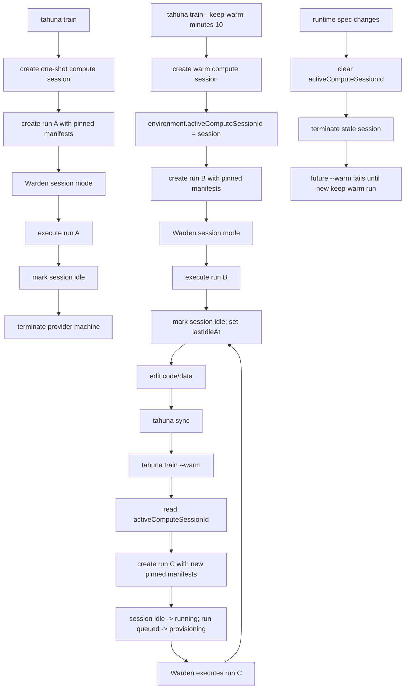

# Separate Compute Lifetime From Run Lifetime

## Model

Tahuna separates **run lifetime** from **compute lifetime**.

A **run** is one immutable training execution. It owns the run ID, status, logs, metrics, artifacts, terminal result, and the pinned code/data manifests used for that execution.

A **compute session** is the billable provider-machine lifetime for training. It owns provider machine provisioning, runtime spec snapshot, runtime token, liveness, idle policy, provider termination, and compute billing. It can execute one run and terminate immediately, or stay warm and execute multiple runs sequentially while it remains alive.

A compute session never owns the user's code/data truth, run logs, run metrics, artifacts, or terminal result. Those remain owned by runs. The compute session is the machine lease plus cache; runs are immutable workload records assigned to that lease.

The target refactor is that every training run uses a compute session:

- a normal run creates a compute session with no warm idle window and terminates after the run finishes
- a keep-warm run creates a compute session with a user-selected idle window and terminates after the session has been idle for that window
- a warm run attaches to the environment's current idle compute session

Serving is out of scope for this refactor phase. Serve lifecycle and inference routing stay on the current serve-specific path until serving is redesigned separately.

The normal user surface stays run-first:

```bash
tahuna init .
tahuna train

# or keep the training machine warm
tahuna train --keep-warm-minutes 10

# edit code or data
tahuna sync
tahuna train --warm
```

There is no automatic fallback from warm compute to another machine. If warm compute is stale, busy, expired, or dead, the command fails clearly and the user starts a new keep-warm run.

The run lifecycle stays unchanged from the user's perspective. A normal run still appears as one run with one terminal result. A warm run still appears as a separate run with its own pinned manifests, logs, metrics, and artifacts. The compute-session refactor changes the internal machine and billing grain, not the run contract.

## Canonical Link

Warm compute is environment-scoped. Each environment has at most one current warm session:

```ts
environments.activeComputeSessionId?: Id<"computeSessions">
```

That field is the only canonical current warm-session link. `tahuna train --warm` and Auto-Research trial runs attach only through that exact session. The backend must not search for an arbitrary compatible idle session.

Normal one-shot training sessions do not become the active warm session. They create a compute session for billing and provider lifecycle, execute one run, then terminate.

## Training Compute Lifetime Modes

The same compute-session lifecycle supports two training lifetime modes.

### One-Shot Training

Plain `tahuna train` and `tahuna run create` create a compute session with a one-shot idle policy:

1. Tahuna creates a `computeSessions` row.
2. Tahuna stores the requested runtime spec snapshot on the session.
3. Tahuna creates the run as a normal run with `executionMode = "ephemeral"` and `computeSessionId`.
4. The session machine starts Warden in session mode and executes the run.
5. When the run reaches a terminal state, Warden marks the session idle.
6. Because the idle policy is one-shot, Tahuna immediately schedules provider termination.
7. The run remains terminal and inspectable after the compute session terminates.

The user should not see this as a new mode. It is still just a normal training run.

### Keep-Warm Training

When a keep-warm run creates a session:

1. Tahuna creates a `computeSessions` row.
2. Tahuna stores the requested runtime spec snapshot on the session.
3. Tahuna stores the requested warm idle policy on the session.
4. Tahuna sets `environments.activeComputeSessionId` to the new session.
5. If the environment already had an active session, Tahuna schedules the old one for termination.
6. Tahuna creates the baseline run as a normal run with `executionMode = "session"` and `computeSessionId`.
7. The session machine starts Warden in session mode and executes the run.

When a warm run is requested:

1. Backend reads `environments.activeComputeSessionId`.
2. Backend loads that exact session.
3. Backend requires the session to be alive, idle, heartbeat-fresh, and idle-timeout-fresh.
4. Backend creates a new queued session-mode run pointing at that `computeSessionId`.
5. Backend atomically assigns the run to the session.

## Flow



## Keep-Warm Timer

`--keep-warm-minutes <minutes>` asks Tahuna to keep the machine after the run finishes. The CLI sends `keep_warm_after_minutes`; the backend converts it to `idleTimeoutSeconds = ceil(minutes * 60)` and stores it on the compute session.

One-shot training uses the same idle transition, but with an immediate termination policy. It must not become reusable warm compute and must not set `environments.activeComputeSessionId`.

The timer starts only when the session becomes `idle`. It is based on:

```text
lastIdleAt + idleTimeoutSeconds
```

`lastIdleAt` is set when Warden reports the assigned run finished and the session can accept another run. It resets after every terminal run that returns the session to idle. It does not advance while a run is executing.

Heartbeats do not reset the idle timer. A healthy but unused warm machine still expires after the requested idle window.

Idle timeout enforcement has two paths:

- A Convex cron checks idle sessions once per minute and terminates expired sessions.
- A `--warm` request also checks the idle timeout synchronously before assignment. If the cron has not run yet, the warm request still refuses and terminates the stale session.

The timeout is not exact to the second. Expected delay is cron interval plus provider termination latency.

## Heartbeats

Heartbeats answer a different question from keep-warm: "is Warden still alive?"

Warden sends a compute-session heartbeat when session mode starts and then periodically while the machine is alive. The backend stores `lastHeartbeatAt`.

Tahuna needs heartbeats because an idle warm session can look reusable in the database even after the provider machine or Warden process has died. Without heartbeat freshness, `tahuna train --warm` could assign a new run to a machine that will never poll.

Heartbeat enforcement has two paths:

- Assignment validates heartbeat freshness before a run can attach to a session.
- A Convex cron checks idle/running sessions once per minute and terminates heartbeat-stale sessions. If a run was active, that run is marked failed with a heartbeat-timeout error.

Startup has a separate budget. Before the first heartbeat exists, the backend uses the provider creation time or session creation time plus the runtime startup timeout. This avoids killing a session immediately during normal machine boot.

## Runtime Spec Invalidation

The compute session stores the exact runtime spec it was created with:

- GPU type
- GPU count
- volume size
- framework
- framework version
- Python version
- resolved image name

Code and data changes do not invalidate warm compute. Users are expected to edit, sync, and create a new run that materializes new pinned manifests on the same machine.

Runtime spec changes do invalidate warm compute. They can come from local sync, dashboard edits, or remote environment update APIs. When the effective runtime spec changes:

1. `environments.activeComputeSessionId` is cleared.
2. The old session is scheduled for provider termination.
3. Future `--warm` requests fail with the stale warm-compute message.
4. The user must start a new keep-warm run.

Assignment also validates the exact runtime spec, so a stale session cannot accept a run even if some caller bypasses the local CLI guard.

## Assignment Rules

Session assignment is atomic and strict. A run can attach to a compute session only when all are true:

- same user
- same environment
- run is `queued`
- run is explicitly queued for that exact `computeSessionId`
- session is `idle`
- session has no `activeRunId`
- no other active run points at the same session
- session has a provider machine ID
- session has a valid runtime token
- session heartbeat is fresh
- session runtime spec exactly matches the run/environment runtime spec

On success:

- run changes `queued -> provisioning`
- run receives the session `providerMachineId`
- compute session changes `idle -> running`
- `computeSessions.activeRunId = runId`
- run and compute-session events are inserted

If any check fails, Tahuna does not provision replacement ephemeral compute.

## Warden Session Mode

Warden enters session mode when `TAHUNA_COMPUTE_SESSION_ID` is present.

In session mode, Warden:

1. Starts once on the provider machine.
2. Sends compute-session heartbeats.
3. Polls `/api/compute_sessions/{id}/runtime/assignment`.
4. Receives at most one assigned run at a time.
5. Fetches that run's bootstrap plan.
6. Materializes that run's pinned code/data manifests.
7. Reuses compatible local cache/dependency state.
8. Executes the run command.
9. Sends logs, metrics, artifacts, and terminal status to the run endpoints.
10. Calls the session idle endpoint after the run reaches a terminal state.
11. Returns to polling for the next assignment.

Warden does not choose runs and does not decide what code is current. The backend assigns runs; each run record owns its snapshot.

## Data Model

### `environments`

| Field | Purpose |
| --- | --- |
| `activeComputeSessionId` | Current warm session for the environment. This is the canonical link. |

### `computeSessions`

| Field | Purpose |
| --- | --- |
| `userId` | Session owner. |
| `environmentId` | Owning environment. |
| `status` | `provisioning`, `idle`, `running`, `terminating`, `terminated`, or `failed`. |
| `providerMachineId` | Provider machine identifier. |
| `runtimeTokenHash` | Session runtime callback credential hash. |
| `activeRunId` | Currently assigned run while status is `running`. |
| `effectiveGpuType` | GPU type snapshot. |
| `effectiveGpuCount` | GPU count snapshot. |
| `effectiveVolumeGb` | Volume snapshot. |
| `framework` | Runtime framework snapshot. |
| `frameworkVersion` | Runtime framework version snapshot. |
| `pythonVersion` | Python version snapshot. |
| `imageName` | Resolved runtime image snapshot. |
| `idleTimeoutSeconds` | Warm idle lifetime. One-shot sessions use an immediate termination policy. |
| `lastHeartbeatAt` | Last Warden liveness heartbeat. |
| `lastIdleAt` | Most recent idle transition. |
| `computeStartedAt` | Billing start, set when provider machine provisioning succeeds. |
| `computeEndedAt` | Billing end, set when provider termination succeeds or is finalized. |
| `computeHourlyRateCents` | Price snapshot for this compute session. |
| `computeChargeCents` | Current or final compute charge. |
| `computeCollectedCents` | Credits collected for this compute session. |
| `computeOutstandingCents` | Uncollected compute charge, if credits are insufficient. |
| `computeChargeStatus` | `pending`, `charged`, or `owed`. |
| `computeChargeError` | Failure detail for pricing or collection errors. |
| `terminatedAt` | Terminal timestamp. |
| `error` | Failure detail. |

### `runs`

| Field | Purpose |
| --- | --- |
| `executionMode` | User-facing run mode: `ephemeral` for one-shot training, `session` for warm compute reuse. |
| `computeSessionId` | Compute session used by the run. After this refactor, every training run has one. |

Run responses expose `execution_mode`, `compute_session_id`, and `compute_session_idle_expires_at` when applicable.

## State Machines

Compute session:

```text
provisioning -> idle -> running -> idle -> terminating -> terminated
        |                              |
        +------------------------------> failed
```

Session run:

```text
queued -> provisioning -> running -> completed
                          |       -> failed
                          |       -> cancelling -> cancelled
```

For compute-session-assigned runs, `provisioning` means "assigned to a provider machine and preparing this run snapshot." Provider machine creation belongs to the compute session, not the run lifecycle.

## CLI Rules

Supported warm-compute commands:

```bash
tahuna train
tahuna train --keep-warm-minutes <minutes>
tahuna train --warm
tahuna train --no-keep-warm
```

Rules:

- `train.keep_warm_after_minutes` in `tahuna.toml` makes plain `tahuna train` behave like `--keep-warm-minutes`.
- `--no-keep-warm` disables the project default for that run.
- `--warm` requires an existing current idle session.
- `--warm` cannot be combined with `--keep-warm-minutes`.
- `--warm` cannot be combined with GPU or volume overrides.
- Warm failure never silently provisions a replacement ephemeral machine.

## Auto-Research

Auto-Research uses the same warm-compute model as `tahuna train`.

The baseline run owns the warm session:

```bash
tahuna research run \
  --program program.md \
  --metric final:eval_loss \
  --minimize \
  --max-trials 5 \
  --max-spend-usd 5 \
  --max-trial-minutes 30 \
  --keep-warm-minutes 10 \
  --editable train.py
```

Resumed trials use warm assignment:

```bash
tahuna research run --resume <session-id>
```

Important rules:

- Auto-Research requires explicit `--keep-warm-minutes` to start a warm baseline.
- It does not inherit `train.keep_warm_after_minutes`, because research warm idle spend must be opt-in.
- The research session stores the starting runtime spec from local `tahuna.toml`.
- Resume rejects local runtime-spec drift before sync or run creation.
- Backend assignment still validates exact runtime spec, so remote environment edits cannot attach incompatible runs.
- Each baseline/trial remains a separate run with its own pinned manifests, logs, metrics, artifacts, and terminal result.
- Trial runs are sequential on one warm session. One active run per session is allowed.
- Stale or busy warm-compute errors surface directly; the harness does not silently fall back.
- The harness ignores Tahuna-owned local state (`tahuna.toml` and `.tahuna/`) for dirty-file and research-patch safety, while editable user files remain guarded by `--editable`.

## Termination

Tahuna terminates a compute session when:

- the keep-warm idle timeout expires
- the session heartbeat times out
- the environment runtime spec changes
- a newer keep-warm session replaces the current session
- the user or backend explicitly stops/removes the session or owning run
- provisioning/session startup fails

Termination clears the active environment link, marks the session terminating, calls the provider termination API, and marks the session terminated after success. Provider termination uses retry/backoff; if retries are exhausted, the session is marked failed.

The backend guarantee is "do not assign more work and request provider termination with retries." Exact process death depends on the provider completing termination.

## Billing And Spend

Compute billing accrues on the compute session while the provider machine is alive. This includes provider startup, runtime bootstrap, active run execution, and warm idle time.

The credit enforcement policy is defined in `specs/billing.md`. The short version:

- training compute-session launch requires enough available credits for one hour of the selected runtime before provider provisioning
- live training compute debits run every 5 minutes and recompute exact cumulative uptime
- if the ledger cannot collect the full target charge, the compute session terminates with reason `insufficient_credits`
- reservations are holds against available credits, not upfront ledger debits

The compute session is the canonical billing reference for training compute:

- live debit idempotency keys are keyed by `computeSessionId`
- pricing fields live on the compute session runtime spec snapshot
- `computeStartedAt` is set when the provider machine is provisioned
- `computeEndedAt` is set when provider termination succeeds or when termination failure is finalized
- the final training compute charge is settled against the compute session

Runs may expose derived billing fields for user-facing summaries, but they must not be the source of truth for provider-machine spend. This avoids double billing and makes idle warm time auditable.

For one-shot training, attribution is simple: the compute session has exactly one assigned run, so the full charge can be displayed on that run.

For keep-warm training, the compute session may execute multiple runs. Active execution time can be attributed to the active run, while idle time belongs to the compute session. Auto-Research and dashboard spend summaries should display that idle spend explicitly rather than silently spreading it across trials.

Until that exists, Auto-Research requires explicit `--keep-warm-minutes` so idle spend is never inherited silently from project training defaults.

## Serve Out Of Scope

Serving remains separate during this refactor phase.

The training compute-session refactor must not change:

- serve creation
- serve status transitions
- serve runtime callbacks
- serve inference proxying
- serve stop/termination behavior
- existing serve billing behavior

Serving should later move to the same billable compute-lifetime model, but that requires a separate design because inference has long-lived health, readiness, routing, and proxy concerns that are not part of training runs. In that later model, the compute session should own provider-machine lifetime, reservation, and compute billing while the serve owns serving identity, health, routing, inference proxying, model snapshot, logs, and user-facing status.

## Current Status

Implemented:

- compute session schema and events
- canonical `environments.activeComputeSessionId` warm-session link
- `tahuna train --keep-warm-minutes`
- `tahuna train --warm`
- `tahuna train --no-keep-warm`
- project `train.keep_warm_after_minutes`
- Warden session mode
- session assignment, heartbeat, and idle callbacks
- atomic assignment with runtime-spec and liveness validation
- idle timeout enforcement
- heartbeat timeout enforcement
- runtime spec invalidation with stale-session termination
- stale-session provider termination retry/backoff
- Auto-Research explicit warm baseline and warm trial reuse
- Auto-Research runtime-spec pinning across resumes
- one-shot training runs provision through compute sessions
- training compute billing source of truth moved from runs to compute sessions
- one-shot attached run summaries expose derived compute-session charges for compatibility
- one-hour compute-session reservation model
- 5-minute training compute billing cadence
- insufficient-credit compute-session termination enforcement

Still pending:

- user-facing compute session inspect/stop controls
- better warm-session billing display for Auto-Research idle time
- serving compute-session migration
- operational guardrail that all deployed runtime images include Warden session mode

## Acceptance Criteria

- Plain `tahuna train` creates a one-shot compute session, creates one run assigned to that session, executes it, and terminates the provider machine after the run reaches a terminal state.
- `tahuna train --keep-warm-minutes 10` creates a run, provisions one session-mode machine, executes the run, and leaves the session idle.
- `tahuna train --warm` creates a new run and attaches only through `environments.activeComputeSessionId`.
- One-shot compute sessions never set `environments.activeComputeSessionId`.
- Training compute-session launch is rejected before provider provisioning unless the user has enough available credits for one hour of the selected runtime.
- Active training compute sessions are billed every 5 minutes from exact uptime.
- A training compute session terminates with reason `insufficient_credits` if the billing tick cannot collect the full target charge.
- Reused runs keep distinct run IDs, logs, metrics, artifacts, manifest hashes, and terminal statuses.
- Provider machine ID is reused across warm runs.
- Code/data sync does not invalidate warm compute.
- Runtime spec sync/update clears the active session and terminates the stale machine.
- Heartbeat-stale sessions cannot accept new assignments.
- Idle-expired sessions cannot accept new assignments.
- Warm failure never silently provisions a replacement ephemeral machine.
- Training compute billing is keyed by compute session, with no duplicate billing on the attached run.
- Existing run lifecycle states and user-facing run responses remain backward compatible.
- Existing serve lifecycle and inference behavior remain unchanged by the training refactor.
